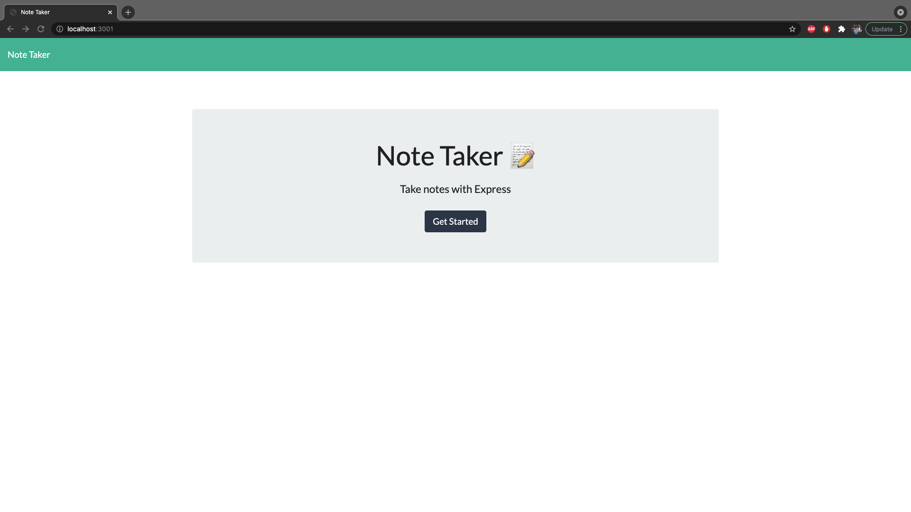
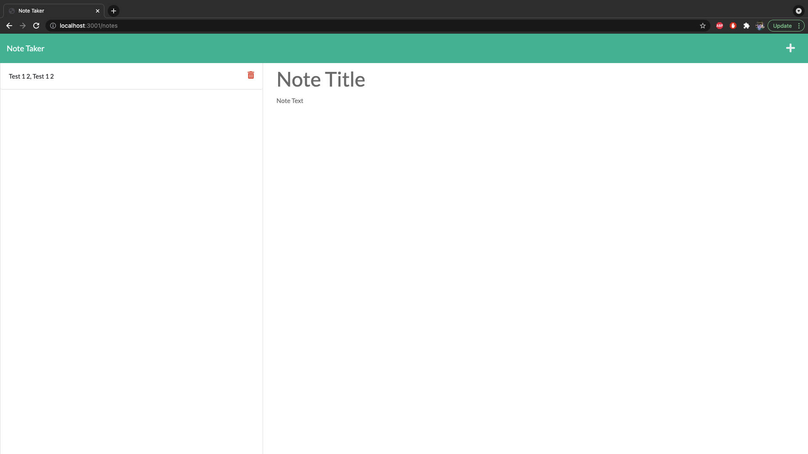

# Note Taker 2.0

## Description

This web application allows users to take notes, save them to the side to access them later. When users are done ultilizing the notes they may delete them.

## Link to Application

[Link to App](https://powerful-reef-72417.herokuapp.com/)

## Technologies Used

* Express.js
* Heroku
* Node.js

## Table of Contents

* [Installation](#installation)
* [Usage](#usage)
* [Contribution](#contribution)
* [Testing](#testing)
* [Questions](#questions)

## Installation

Run the following commands to install needed dependencies:

```
npm i
```

## Contribution

If users with to contribute please reach out to be via GITHUB or eMail

## Screenshots




## Questions

For any questions, please contact me by email or through my GitHub page
* [eMail](mailto:kcmusedev@gmail.com)
* [Kaleb Muse](https://github.com/kcmuse)